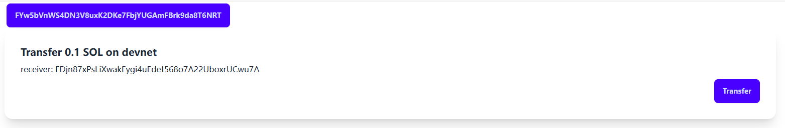

# Solana wallet demo

Interact solana wallet using `web3.js` v2

## Background

The recommended way to connect a solana wallet in frontend code is using `@solana/wallet-adapter-base` and concrete adapter like `@solana/wallet-adapter-phantom`
But these package has some limitations:

1. Outdated, hasn't been updated for years
2. Depends on `web3.js` V1, This library depends on legacy version of bs58 which depends on node:buffer which would cause my cloudflare pages app crash

## The new one

This is just a demo project for me to learn the new `web3.js` V2 api, Most code is copied from https://github.com/solana-labs/solana-web3.js/tree/master/examples/react-app
The official supported framework is react, but I don't like it, so I rewrite in sveltekit

How to run locally:

```shell
bun i
bun run dev # http://localhost:5173
```

## Gallery


